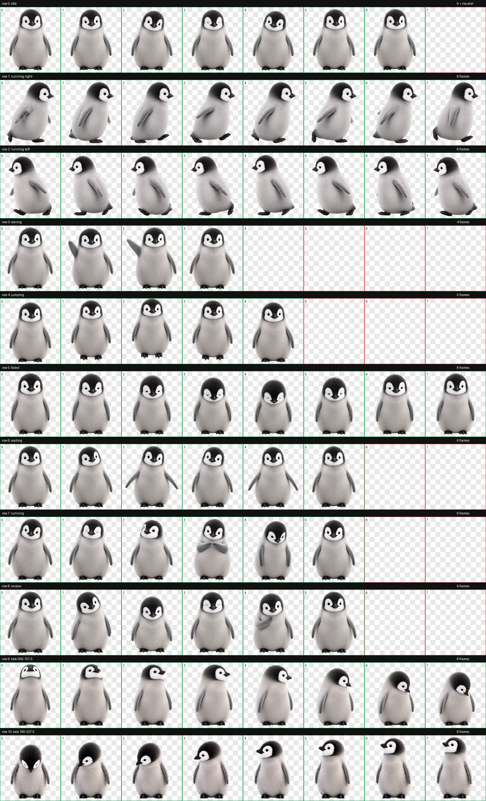

# Pingo

Pingo is a soft, semi-realistic Emperor Penguin chick pet for Codex. The
package includes smooth animations, sixteen look directions, and the complete
Codex v2 spritesheet.

## In Codex


## Animation sheet



## Features

- Nine standard pet animations
- Sixteen clockwise look directions
- Transparent WebP spritesheet
- `192x208` cells in an `8x11` grid
- Windows, macOS, and Linux installation
- Automated package validation

## Install

### Windows

```powershell
.\scripts\install.ps1
```

### macOS or Linux

```bash
./scripts/install.sh
```

The installer copies Pingo to `${CODEX_HOME}/pets/pingo`. When `CODEX_HOME` is
not set, it uses `.codex` in the current user's home directory.

If Codex is already running, reopen the pet selector after installation.

### Manual installation

Copy the contents of `pet/` to:

```text
~/.codex/pets/pingo
```

Keep `pet.json` and `spritesheet.webp` together.

## Restore from GitHub

```powershell
gh repo clone mikerte/penguin-codex-pet
cd penguin-codex-pet
.\scripts\install.ps1
```

## Validate

```bash
python -m pip install -r requirements-dev.txt
python scripts/validate_pet.py
```

The validator checks the metadata, atlas dimensions, required animation cells,
transparency, and committed spritesheet checksum. GitHub Actions runs the same
validation on changes to `main`.

## Repository layout

```text
pet/        Installable Pingo package
previews/   Animation previews
scripts/    Installers and package validator
```

## Maintenance

Pingo is a single-owner project. External contributions are not accepted.
Changes are expected only when the pet package or Codex pet format needs an
owner-approved update.

## License

Pingo is released under the [MIT License](LICENSE). Anyone may use, copy,
modify, publish, distribute, sublicense, or sell the repository's code,
documentation, pet artwork, animation assets, and previews under its terms.

See [THIRD_PARTY_NOTICES.md](THIRD_PARTY_NOTICES.md) for separately licensed
third-party material.
